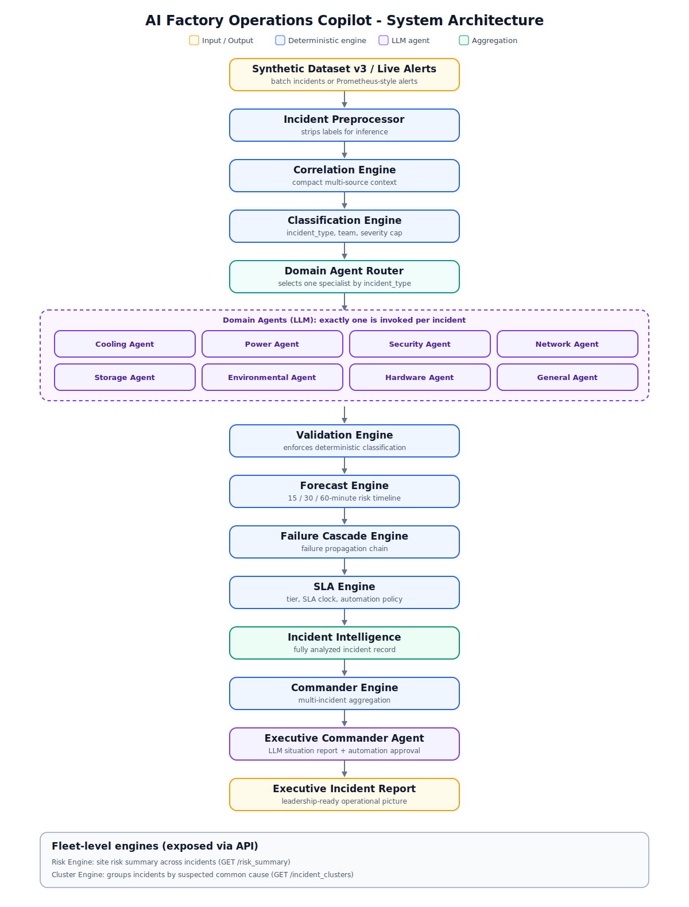
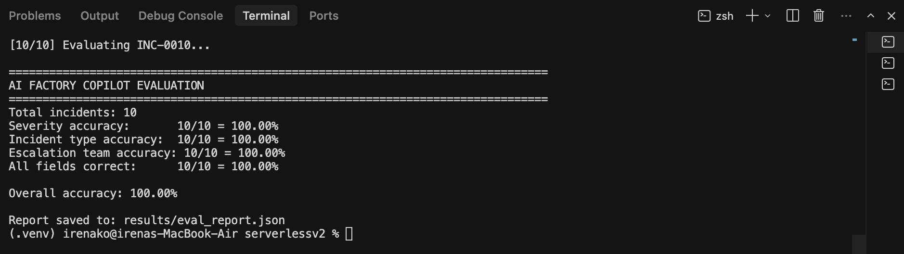
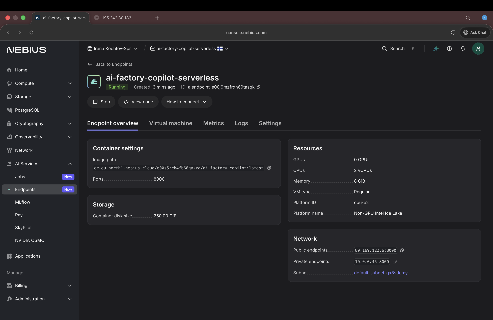
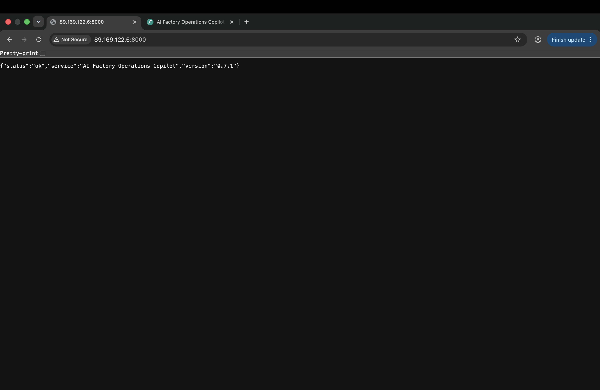
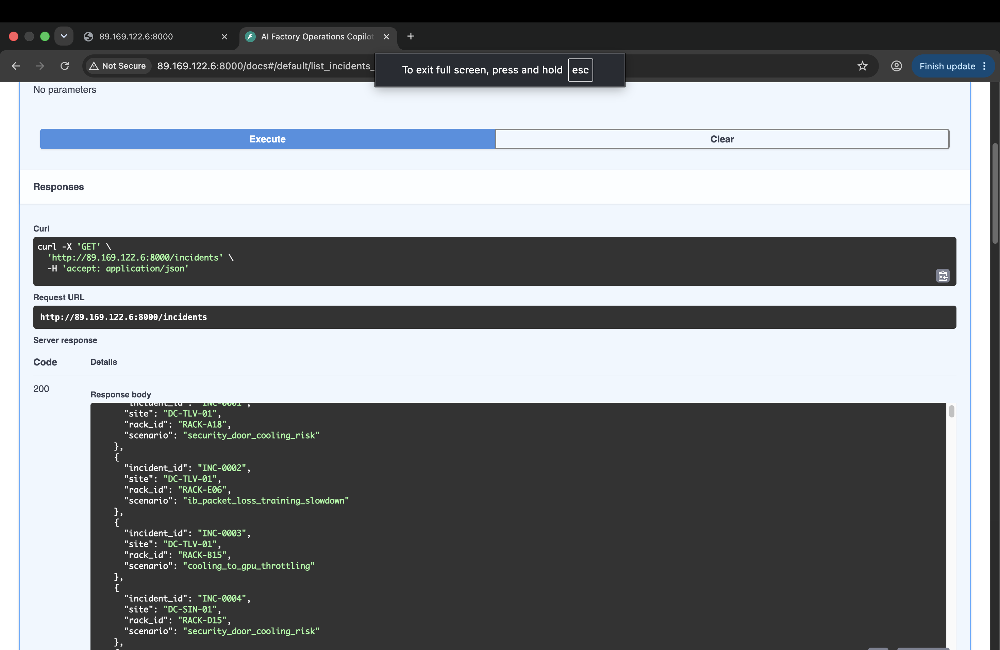
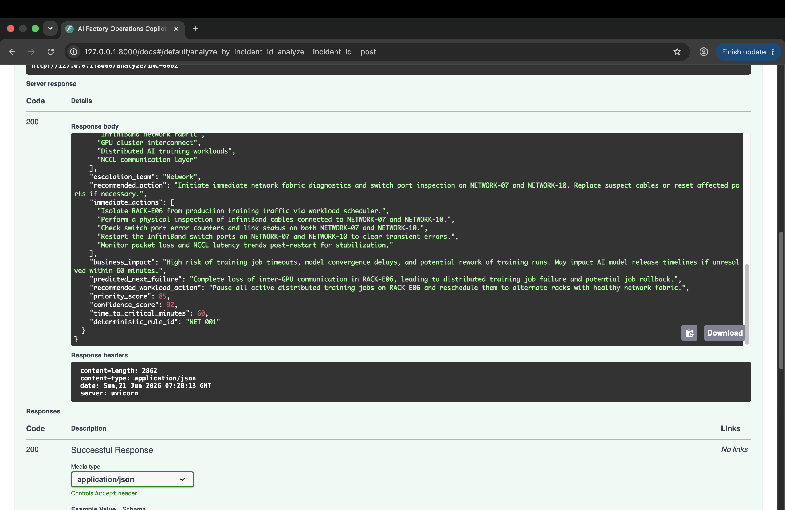
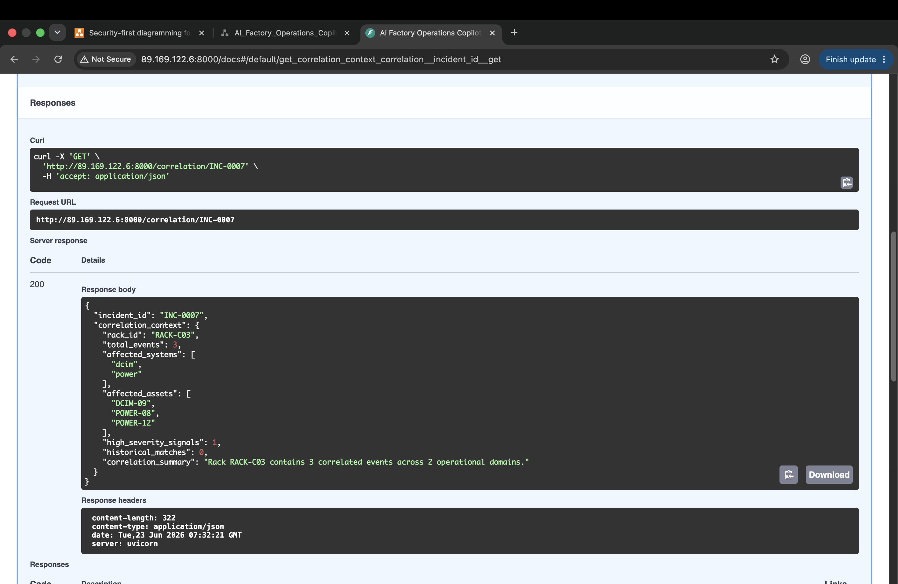
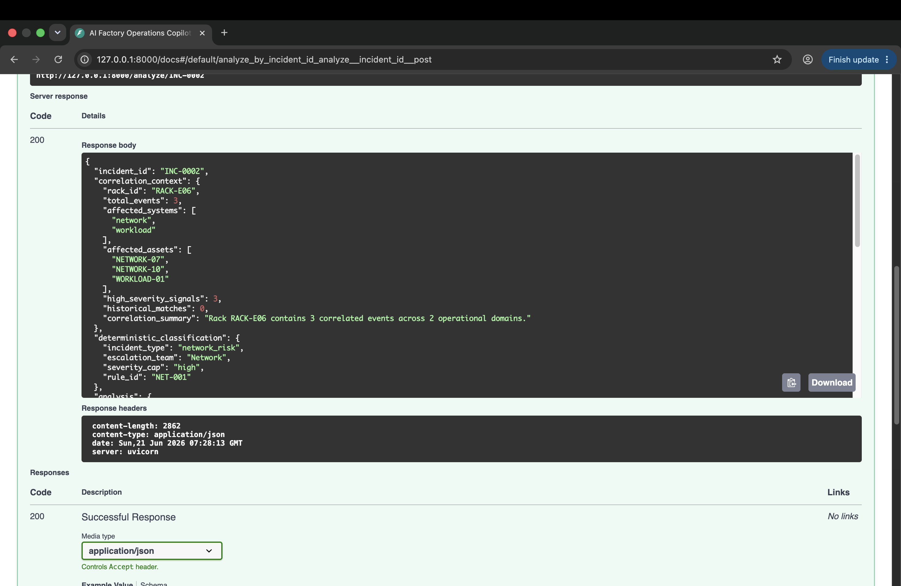
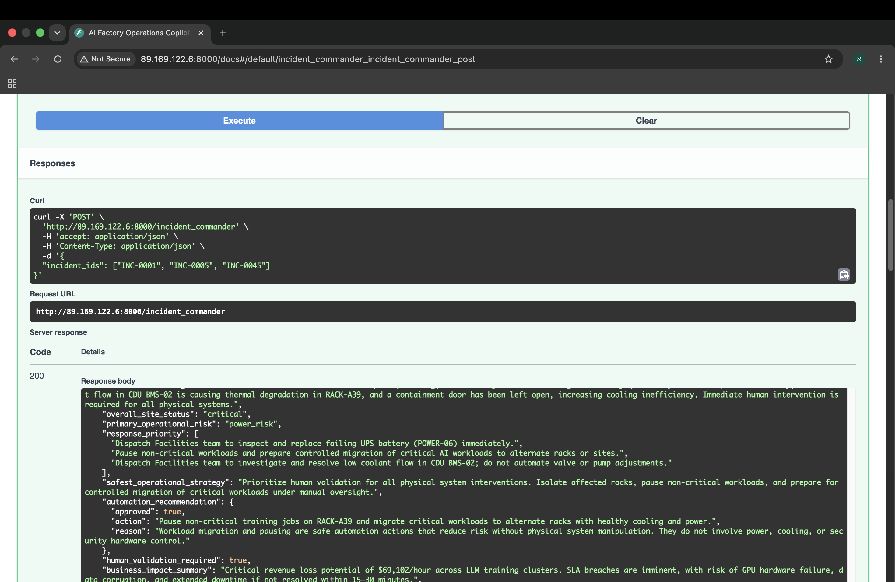
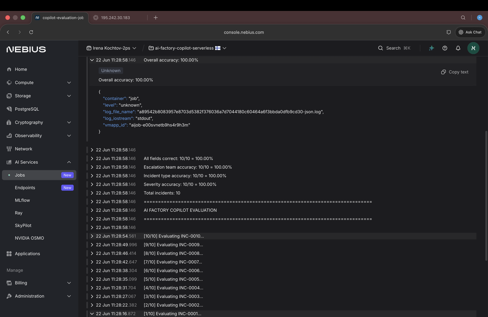

# AI Factory Operations Copilot

The **AI Factory Operations Copilot** is an incident triage and decision-support system for hyperscale AI data centers. It ingests multi-source operational signals (BMS, DCIM, GPU telemetry, network, power, cooling, storage, workload, environmental, and security events), classifies each incident deterministically, routes it to a domain-specialized LLM agent for root-cause and impact analysis, and coordinates everything through an executive **Incident Commander** agent. It is built to run on **Nebius Serverless AI** and pairs deterministic engines with LLM reasoning so that operators get explainable, safety-aware recommendations rather than opaque model output.

---

## Key Capabilities

| Capability | Status | Description |
|---|---|---|
| Domain-Routed AI Agents | ✅ | Incidents are routed by `incident_type` to a specialized agent prompt (cooling, power, network, security, storage, environmental, hardware, or generalist). |
| Executive Incident Commander | ✅ | Aggregates multiple analyzed incidents into a single executive situation report with prioritized response actions. |
| SLA-Aware Decision Support | ✅ | Maps incidents to customer SLA tiers, computes an SLA countdown clock, and surfaces breach risk. |
| Deterministic Incident Classification | ✅ | Rule-based classification of `incident_type`, `escalation_team`, and a severity cap before any LLM call. |
| Root Cause Analysis | ✅ | LLM-generated root cause, event propagation path, and affected systems. |
| Failure Forecasting | ✅ | Deterministic 15 / 30 / 60-minute forward risk timeline per incident type. |
| Failure Cascade Prediction | ✅ | Ordered cascade chain describing how an incident is likely to propagate. |
| Safe Automation Guardrails | ✅ | Explicit safe vs. restricted automation actions and human-validation requirements. |
| Running on Nebius Serverless AI | ✅ | LLM inference served via the Nebius OpenAI-compatible endpoint; deployable as a serverless container. |

---

## The Problem

A modern AI factory is not a single system. It is a tightly coupled stack of physical and digital infrastructure where a failure in one layer cascades into the others:

- **BMS** (Building Management System) governs facility-level cooling, airflow, and environmental controls.
- **DCIM** (Data Center Infrastructure Management) tracks rack-level power, thermal, and capacity signals.
- **GPU clusters** run at high density and are extremely sensitive to thermal and power fluctuations.
- **AI workloads** (distributed training and inference) depend on every layer below them staying healthy.
- **Power** systems (UPS, PDU, feeds) protect against utility instability but degrade over time.
- **Cooling** systems (CDU, CRAC/CRAH, coolant loops) keep GPUs below throttling thresholds.
- **Security** systems monitor physical access and containment, which directly affect airflow.

Incident response is difficult because:

- **Signals are fragmented** across many monitoring systems with different formats and thresholds.
- **Failures cascade across domains** — a cooling fault becomes a GPU throttling event becomes a missed training deadline.
- **Time-to-critical is short** — thermal and power incidents can reach critical state in minutes.
- **Routing is ambiguous** — operators must decide quickly whether Facilities, Network, Platform, or Operations owns the response.
- **Automation is dangerous** — blindly automating physical remediation (restarting a UPS, opening a valve) can cause real-world damage.

---

## Solution Overview

This project combines **deterministic reasoning** with **LLM agents** so that each part of the system does what it is best at.

- **Deterministic engines** handle everything that must be reliable, explainable, and cheap: classification, correlation, severity capping, forecasting, cascade modeling, similarity lookup, and SLA assessment. These never depend on model output for routing decisions.
- **LLM domain agents** handle everything that benefits from reasoning over context: root-cause analysis, business-impact assessment, operational recommendations, and predicted next failure.
- A **validation layer** enforces the deterministic classification over the LLM response, guaranteeing that `incident_type` and `escalation_team` remain trustworthy and that severity never exceeds its cap.

The result is a system where the LLM adds narrative and judgment, but the operational guarantees come from deterministic code.

---

## System Architecture

The per-incident analysis pipeline (`pipeline.py`) runs deterministic preprocessing and classification first, calls exactly one routed domain agent, then enriches the result with deterministic forecasting, cascade, history, and SLA layers:



A text view of the same pipeline:

```
                          Dataset v3 (or live alert)
                                    |
                                    v
                          Incident Preprocessor        (strips labels for inference)
                                    |
                                    v
                          Correlation Engine           (compact multi-source context)
                                    |
                                    v
                          Classification Engine        (incident_type, team, severity cap)
                                    |
                                    v
                          Domain Agent Router          (selects specialist by incident_type)
                                    |
            +-----------+-----------+-----------+-----------+-----------+
            v           v           v           v           v           v
        Cooling      Power      Security     Network     Storage /    General
         Agent       Agent       Agent        Agent     Env / HW      Agent
            +-----------+-----------+-----------+-----------+-----------+
                                    |
                                    v
                          Validation Engine            (enforces deterministic classification)
                                    |
                                    v
                          Forecast Engine              (15 / 30 / 60-min risk timeline)
                                    |
                                    v
                          Cascade Engine               (failure propagation chain)
                                    |
                                    v
                          Incident History Engine      (similar past incidents)
                                    |
                                    v
                          SLA Engine                   (tier, SLA clock, automation policy)
                                    |
                                    v
                          Analyzed Incident
                                    |
                                    v
                          Commander Agent              (multi-incident coordination)
                                    |
                                    v
                          Executive Report
```

Two additional deterministic engines operate at the **fleet level** rather than per incident, and are exposed directly through the API:

- **Risk Engine** (`risk_engine.py`) — aggregates analyzed incidents into a site risk summary (`/risk_summary`).
- **Cluster Engine** (`cluster_engine.py`) — groups incidents by suspected common cause (`/incident_clusters`).

---

## AI Domain Agents

Incidents are routed **deterministically**. The Classification Engine assigns an `incident_type`, and the Domain Agent Router (`agent_router.py`) uses that value to look up a specialized system prompt in the Agent Registry (`agent_registry.py`). The selected prompt is sent to the shared LLM runner (`llm_client.py`) together with a user prompt that carries the exact response schema and rules.

### Implemented agents

| Agent | Routed Incident Type | Diagnostic Focus |
|---|---|---|
| Cooling Agent | `cooling_risk` | CDU/CRAH/CRAC behavior, coolant flow and pressure, rack inlet temperature, hot-aisle containment, GPU thermal throttling cascade. |
| Power Agent | `power_risk` | UPS runtime and battery health, PDU load, power feeds and redundancy, shutdown risk during utility instability. |
| Security Agent | `security_risk` | Physical access events, containment doors, badge/access control, and secondary airflow effects. |
| Network Agent | `network_risk` | InfiniBand/Ethernet fabric health, packet loss, optics, congestion, NCCL collective latency, training step time. |
| Storage Agent | `storage_risk` | Storage/filesystem latency (p99), IO queue depth, throughput, NVMe/controller health, checkpoint impact. |
| Environmental Agent | `environmental_risk` | Room-level humidity and temperature drift versus operating envelope and escalation risk. |
| Hardware Agent | `hardware_risk` | GPU/server hardware faults, ECC, NVLink, node-level degradation, and workload stability. |
| General Agent | fallback | Used when the incident type is unknown or unmapped; preserves the original generalist behavior. |

Every agent shares one core system prompt and one response schema, so all agents return an **identical JSON structure**. Only the domain specialization differs.

### Why routing instead of broadcasting

- **Cost and latency** — one LLM call per incident instead of fanning out to every domain agent.
- **Determinism** — routing decisions come from rule-based classification, not from model output.
- **Consistency** — a single source of truth for `incident_type` and `escalation_team`, enforced after inference.
- **Maintainability** — agents are configuration (prompts) rather than parallel code paths, so adding a domain is a registry entry, not new orchestration.

---

## SLA Engine

The SLA Engine (`sla_engine.py`) ties each incident to its business and contractual context.

- **SLA contracts** — Customer tiers (`gold`, `silver`, `bronze`, `standard`) map to availability targets and automation policy in `sla_contracts.json`. Tier is read from the incident's `business_context.customer_tier`, falling back to `standard`.
- **SLA countdown** — An `sla_clock` reports `status`, `minutes_remaining`, and a `breach_state` (`monitoring` → `at_risk` → `warning` → `critical`) derived from time-to-critical and priority score.
- **Human validation** — Contracts can require human field validation before any physical remediation; this is surfaced as `human_validation_required`.
- **Safe automation** — Low-risk actions that may be automated, such as `pause_non_critical_workloads`, `migrate_workloads`, and `notify_operations`.
- **Restricted automation** — High-risk physical actions that must not be automated, such as `restart_ups`, `restart_cdu`, `switch_power_feed`, and `open_valve`.

The SLA assessment is attached to every analyzed incident as `sla_assessment`.

---

## Executive Incident Commander

The Incident Commander turns a set of individually analyzed incidents into a single, leadership-ready operational picture. It is implemented as a deterministic aggregation layer (`commander_engine.py`) feeding an LLM commander agent (`commander_agent.py`).

**Responsibilities**

- **Executive summaries** — Produces an executive briefing, an overall site status (`stable` / `elevated` / `high_risk` / `critical`), the primary operational risk, and a one-paragraph message for NOC or operations leadership.
- **Multi-incident coordination** — Computes site status from the distribution of severities, identifies the highest-priority incident, collects affected domains and recommended teams, determines the minimum time-to-critical across incidents, and builds a prioritized response plan.
- **Automation approval** — Returns a structured `automation_recommendation` (approved action plus rationale) and an explicit `human_validation_required` flag. It is constrained to never approve automated physical remediation for power, cooling, or security systems, and to require human field validation when power or cooling risk is critical.

The deterministic context (site status, response plan, priorities) is computed in code first, then passed to the LLM so the executive report is grounded in the same numbers operators see.

---

## Business Impact and SLA Awareness

Incidents in an AI factory are not equal, and neither is their business consequence. This project prioritizes incidents using **both technical severity and business context**, so that two thermally similar events can still be triaged differently based on who they affect. Each incident in `dataset_v3.json` carries a synthetic `business_context` block — including a `customer_tier` (`gold`, `silver`, `bronze`, `standard`) — that demonstrates how operational prioritization would work against real customer commitments. Customer tier maps directly to an SLA target (for example, `gold` to `99.95%`), and the SLA Engine combines that target with the incident's time-to-critical and priority to produce an **SLA countdown clock** showing how much response time remains before customer impact.

This business signal flows through the rest of the system. The Commander Agent uses SLA state and priority to order multi-incident response, so the highest-business-risk incidents surface first in the executive report. All monetary figures (such as revenue-impact values) are **synthetic demonstration values only and are not real financial calculations**; they exist to illustrate prioritization, not to model actual cost.

Business awareness never overrides safety. **Safe automation is limited to workload-level actions** — migrating workloads, pausing non-critical jobs, and notifying operators. **Any physical remediation — UPS, CDU, valves, power feeds, or cooling equipment — always requires human validation** and is explicitly listed as a restricted action. The system is designed to accelerate human decision-making under SLA pressure, not to take unsupervised physical action.

---

## Repository Structure

```
serverlessv2/
├── api.py                       # FastAPI app and HTTP endpoints
├── pipeline.py                  # Per-incident analysis pipeline orchestration
│
├── llm_client.py                # Shared Nebius/OpenAI-compatible LLM runner + JSON parsing
├── copilot.py                   # Operational Copilot entrypoint (delegates to the router)
├── agent_router.py              # Deterministic domain-agent router
├── agent_registry.py            # incident_type -> specialized prompt mapping
├── agent_prompts.py             # Core + per-domain system prompts, schema, and rules
│
├── classification_engine.py     # Deterministic incident classification
├── correlation_engine.py        # Multi-source correlation context
├── validation_engine.py         # Enforces deterministic classification + severity cap
├── forecast_engine.py           # 15/30/60-minute failure forecast
├── cascade_engine.py            # Failure cascade chains
├── incident_history_engine.py   # Similar historical incidents
├── sla_engine.py                # SLA tier, clock, and automation policy
├── risk_engine.py               # Fleet-level risk summary
├── cluster_engine.py            # Incident clustering by common cause
├── rules_engine.py              # Supplementary operational rules
│
├── commander_engine.py          # Multi-incident aggregation for the commander
├── commander_agent.py           # Executive Incident Commander LLM agent
│
├── prometheus_adapter.py        # Converts Prometheus-style alerts into incidents
├── incident_preprocessor.py     # Strips labels before inference
│
├── evaluate.py                  # Deterministic evaluation harness
├── generate_dataset_v3.py       # Builds dataset_v3.json from the base v2 dataset
│
├── dataset_v3.json              # Active enriched incident dataset (business/SLA/metrics)
├── sla_contracts.json           # SLA tier definitions
├── asset_history.json           # Historical asset context for correlation
├── sample_prometheus_alerts.json# Example Prometheus alerts
│
├── Dockerfile                   # Production container image
├── .dockerignore
├── requirements.txt
├── PRODUCT_ARCHITECTURE.md
├── README.md
│
├── docs/
│   └── architecture.svg         # System architecture diagram
│
├── evidence/                    # Screenshots and demo artifacts
│
└── archive/                     # Superseded artifacts kept for provenance (not used at runtime)
    ├── dataset_v2.json          # Base synthetic incident dataset (v2)
    ├── serverless_v2_dataset.json
    ├── generate_dataset_v2.py   # Builds the base v2 dataset
    ├── README_dataset_v2.md
    ├── demo.py
    └── evidence/                # Earlier evidence screenshots
```

> Note: `generate_dataset_v3.py` was the one-time build script used to produce `dataset_v3.json` from the base v2 dataset (now in `archive/`). The committed `dataset_v3.json` is the active dataset and the script does not need to be re-run for normal use.

### API Endpoints

| Method | Path | Description |
|---|---|---|
| `GET` | `/` | Health check. |
| `GET` | `/debug-env` | Report which Nebius environment variables are configured (booleans and non-secret values only). |
| `GET` | `/incidents` | List incidents in the active dataset. |
| `POST` | `/analyze/{incident_id}` | Run the full pipeline on a single incident. |
| `POST` | `/analyze_alert` | Convert a Prometheus-style alert into an incident and analyze it. |
| `GET` | `/correlation/{incident_id}` | Return the correlation context for an incident. |
| `GET` | `/risk_summary` | Fleet-level risk summary across incidents. |
| `GET` | `/incident_clusters` | Group incidents by suspected common cause. |
| `POST` | `/incident_commander` | Generate an executive report for a set of incident IDs. |

---

## Evaluation

Evaluation is **deterministic and label-based** (`evaluate.py`). For each incident, the harness strips ground-truth labels, runs the full analysis pipeline, and compares the prediction against ground truth on three fields: `severity`, `incident_type`, and `escalation_team`. Results are written to `results/eval_report.json`.

Run it with:

```bash
python evaluate.py --max-incidents 10
```

On the evaluated sample the pipeline reports **100% accuracy** across severity, incident type, and escalation team:

```
Total incidents: 10
Severity accuracy:       10/10 = 100.00%
Incident type accuracy:  10/10 = 100.00%
Escalation team accuracy: 10/10 = 100.00%
All fields correct:      10/10 = 100.00%
Overall accuracy: 100.00%
```



---

## Running on Nebius

The Copilot uses the **Nebius OpenAI-compatible inference endpoint** for all LLM calls. Configuration is read from environment variables:

| Variable | Purpose |
|---|---|
| `NEBIUS_API_KEY` | Nebius AI Studio API key. |
| `NEBIUS_BASE_URL` | OpenAI-compatible base URL (for example `https://api.studio.nebius.com/v1/`). |
| `NEBIUS_MODEL` | Served model identifier. |

### Local

```bash
pip install -r requirements.txt
python -m uvicorn api:app --host 0.0.0.0 --port 8000
```

### Container / Serverless

The included `Dockerfile` builds a production image (Python 3.11 slim, non-root user, port 8000). Provide the Nebius environment variables at runtime; `.env` is intentionally excluded from the image.

```bash
docker build -t ai-factory-copilot .
docker run -p 8000:8000 \
  -e NEBIUS_API_KEY=... \
  -e NEBIUS_BASE_URL=... \
  -e NEBIUS_MODEL=... \
  ai-factory-copilot
```

The same container is deployed to Nebius as a serverless endpoint exposing the FastAPI Swagger UI:







---

## Evidence

### Root Cause Analysis



### Correlation Engine



### Failure Forecast



### SLA Clock Analysis


### Executive Incident Commander Report



### Deployment





---

## Future Improvements

The current system assumes incidents have already been collected from monitoring systems. Realistic next steps focus on closing the gap to live infrastructure:

- **Live Prometheus ingestion** — Move from the sample alert adapter to a streaming Prometheus integration.
- **DCIM integration** — Ingest real rack-level power, thermal, and capacity telemetry.
- **BMS integration** — Connect facility-level cooling and environmental controls.
- **Streaming events** — Process incidents continuously instead of on request.
- **Multi-site support** — Extend correlation, risk, and commander logic across multiple data center sites.

---

*Built for the Nebius Serverless AI Builders Challenge.*
