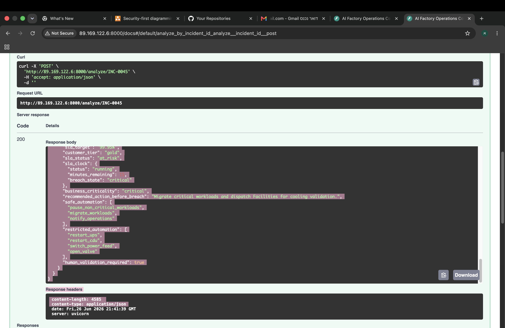

# AI Factory Operations Copilot

> Incident triage and decision support for AI data centers — built on a deterministic engineering core with a single, tightly-scoped LLM reasoning step.


The **AI Factory Operations Copilot** ingests multi-source operational signals from an AI data center, correlates and classifies each incident with deterministic engines, routes it to a domain-specialized LLM agent for reasoning, and then coordinates a fleet-wide executive response through an Incident Commander. The design goal is simple and deliberate: **the LLM explains and recommends; deterministic code decides anything that touches safety or routing.**


---

## Executive Summary

- **What it is** — an incident triage and decision-support service for AI data centers that turns fragmented, multi-source alerts into a single ranked operational picture.
- **Who it is for** — NOC operators, SREs, MLOps, and data center / AI infrastructure engineers who triage cross-system incidents under time pressure.
- **Deterministic + LLM by design** — deterministic engines own correlation, classification, validation, and routing; the LLM owns root-cause reasoning and recommendations. Neither role crosses into the other.
- **One LLM call per incident** — each incident is routed to exactly one domain-specialized agent, keeping latency, cost, and behavior predictable.
- **Incident Commander** — a separate step aggregates many analyzed incidents into one executive report with prioritized, safety-aware response actions.
- **Runs on Nebius Serverless** — inference is served by Nebius AI Studio; the service ships as a container deployable to a Nebius serverless endpoint.

---

## Table of Contents

- [Executive Summary](#executive-summary)
- [Why AI Factory Operations?](#why-ai-factory-operations)
- [The Problem](#the-problem)
- [Motivation](#motivation)
- [Industry Validation](#industry-validation)
- [Solution Overview](#solution-overview)
- [Architecture](#architecture)
- [Prototype vs Production Architecture](#prototype-vs-production-architecture)
- [Domain Agents](#domain-agents)
- [Deterministic Engines](#deterministic-engines)
- [Business Impact](#business-impact)
- [Safety Philosophy](#safety-philosophy)
- [Evaluation](#evaluation)
- [API](#api)
- [Why Nebius?](#why-nebius)
- [Deployment](#deployment)
- [Repository Structure](#repository-structure)
- [Evidence](#evidence)
- [Lessons Learned](#lessons-learned)
- [Future Roadmap](#future-roadmap)
- [Acknowledgements](#acknowledgements)

---

## Why AI Factory Operations?

An **AI factory** is a data center whose primary product is large-scale AI compute: dense racks of GPUs running distributed training and inference around the clock. Unlike a traditional enterprise data center, where workloads are loosely coupled and tolerant of a single node disappearing, an AI factory behaves like one large, tightly-coupled machine.

This changes the operational physics in ways that traditional monitoring was never designed for:

- **Thermal density is extreme.** GPU racks draw and dissipate far more power per square meter than legacy server racks, so cooling faults turn into compute faults in minutes, not hours.
- **Workloads are synchronous.** A distributed training job advances at the speed of its slowest participant. A single degraded network link or throttled GPU stalls thousands of others.
- **Failures cross physical and digital boundaries.** A facilities event (coolant flow drop) becomes a hardware event (GPU thermal throttling) becomes a workload event (training throughput collapse). The root cause and the symptom live in completely different monitoring systems.

Traditional monitoring tools are excellent at answering *"is this metric over threshold?"* They are poor at answering *"which of these forty simultaneous alerts is the root cause, who owns it, and how long until it hurts a customer?"* That second question is the job of this project.

---

## The Problem

An AI factory is observed by many specialized systems, each fluent in its own domain and blind to the others:

| Signal source | What it sees | What it cannot see |
|---|---|---|
| **BMS** (Building Management System) | Facility cooling, airflow, environmental controls | Whether GPUs are actually throttling |
| **DCIM** (Data Center Infrastructure Management) | Rack-level power, thermal, capacity | Distributed job health |
| **GPU telemetry** (e.g. DCGM) | GPU temperature, throttling, utilization | Why the rack got hot |
| **Power** (UPS, PDU, feeds) | Battery health, runtime, load | Downstream workload risk |
| **Cooling** (CDU, CRAC/CRAH, loops) | Coolant flow, pressure, inlet temperature | Which training jobs are at risk |
| **Storage** | Latency, IOPS, checkpoint duration | Whether a checkpoint deadline will be missed |
| **Network** (InfiniBand / Ethernet) | Packet loss, link health, collective latency | The training job stalling because of it |
| **Security** | Physical access, containment doors | The airflow imbalance an open door causes |

The result is **fragmented operational visibility**. Each system raises its own alarms, in its own format, against its own thresholds. During a real incident an operator is handed dozens of correlated-but-uncorrelated alerts and must, under time pressure, reconstruct a single causal story across all of them.

Correlation is hard because the signals are **temporally close but semantically distant**: they share a rack and a timestamp, but nothing in the raw data says "the open containment door caused the inlet temperature rise that caused the throttling." Stitching that narrative together is exactly the cross-system reasoning this Copilot is built to assist.

---

## Motivation

This project grew out of years of hands-on work with **critical infrastructure, building management systems (BMS), and operational technology (OT) environments** — the physical and control-system side of facilities where uptime is non-negotiable and where a small fault in one subsystem can cascade across many others.

That background shaped one core conviction: **cross-system incident investigation is genuinely difficult**, and it gets harder as systems multiply. Watching how long it can take skilled operators to correlate signals across independent monitoring stacks — and how much of that work is pattern recognition rather than novel insight — is what motivated an assistant that does the correlation legwork while leaving judgment and physical action to humans.

To be precise about scope: this experience is in **critical infrastructure and BMS/OT**, not in operating GPU clusters. The AI-factory-specific behavior in this project (GPU thermal cascades, InfiniBand collective stalls, checkpoint pressure) is modeled from domain research and the validation conversations described below — not claimed as first-hand cluster operations experience.

---

## Industry Validation

To keep the operational scenarios realistic, the incident workflows and pain points behind this project were discussed with an **experienced HPC / AI infrastructure engineer**.

These were informal technical conversations, not a formal partnership, and the individual is intentionally not identified. Their input helped validate that the modeled workflows — how a cooling fault propagates into GPU throttling, how InfiniBand packet loss degrades distributed training, how teams actually triage and escalate — reflect real operational reality. That feedback directly influenced architectural decisions, most notably the **deterministic routing and escalation model** and the **strict separation between advisory automation and physical action**.

---

## Solution Overview

The system is built on one architectural philosophy:

> **Deterministic logic for anything that must be correct and explainable. LLM reasoning for everything that benefits from judgment. The two are never allowed to swap roles.**

Concretely:

- **Deterministic classification exists** so that *what kind of incident this is* and *who owns it* are decided by transparent, testable rules — not by a probabilistic model. Routing and escalation must be reproducible and auditable.
- **A validation layer exists** to guarantee the deterministic decision wins. After the LLM responds, validation re-asserts the rule-based `incident_type` and `escalation_team` and caps severity, so a confidently-wrong model answer cannot misroute a critical incident.
- **The LLM never owns a safety-critical decision.** It produces root-cause analysis, business-impact narrative, predicted next failure, and recommended actions. It does not decide classification, escalation, or whether a physical action is permitted. Those are deterministic.

This gives the best of both worlds: the explanatory power and flexibility of an LLM, fenced inside guarantees that come from ordinary, reviewable code.

---

## Architecture

The per-incident pipeline (`pipeline.py`) is a deterministic spine with exactly one LLM step in the middle:

```
Infrastructure signals (dataset_v3.json or live alert)
        |
        v
Incident Preprocessor      strips labels for inference
        |
        v
Correlation Engine         compact multi-source context
        |
        v
Classification Engine      incident_type, escalation_team, severity cap
        |
        v
Domain Agent Router  ----> [ exactly one LLM call ] selected domain agent
        |
        v
Validation Engine          re-asserts deterministic classification, caps severity
        |
        v
Forecast Engine            15 / 30 / 60-minute risk timeline
        |
        v
Cascade Engine             failure propagation chain
        |
        v
Incident History Engine    similar past incidents
        |
        v
SLA Engine                 tier, SLA clock, automation policy
        |
        v
Analyzed incident  ----> (aggregated across many incidents)
        |
        v
Commander Engine + Executive Commander Agent
        |
        v
Executive Decision / Report
```

### Where the LLM is called, and why only once

Within the analysis of a single incident, the LLM is invoked **exactly once** — at the Domain Agent Router step. Everything before it (preprocessing, correlation, classification) prepares trustworthy structured context; everything after it (validation, forecast, cascade, history, SLA) is deterministic enrichment that does not require a model.

Two further design consequences follow:

- **Routing, not broadcasting.** Because classification already knows the domain, the router sends the incident to *one* specialist instead of fanning out to every domain agent and reconciling competing answers.
- **A single source of truth.** With one model call and a deterministic validation gate, `incident_type` and `escalation_team` have exactly one authoritative value.

The **Incident Commander** performs one additional LLM call, but at a different altitude: it runs once over a *set* of already-analyzed incidents to produce a fleet-level executive report. Per-incident analysis and fleet-level command are deliberately separate concerns.

### Engineering Decision

**Exactly one LLM call is performed per incident.** Concentrating inference in a single, well-scoped step gives the system predictable latency, predictable cost, deterministic routing, easier validation, and a smaller failure surface.

---

## Prototype vs Production Architecture

The current repository is an honest **prototype**. Its value is the architecture, which is designed so that domain intelligence can grow without the orchestration changing. The table below separates what exists today from a realistic production evolution.

| Capability | Prototype today | Production evolution |
|---|---|---|
| LLM backend | Single shared model via Nebius (`llm_client.py`) | Same shared client; model choice per domain where justified |
| Domain knowledge | Specialized **prompts** per domain | Prompts **plus** domain RAG |
| Historical incidents | Static illustrative lookup | Real historical incident store, retrieved per domain |
| Vendor documentation | Not present | Vendor manuals / spec sheets as retrieval context |
| Operational runbooks | Not present | Runbooks retrieved to ground recommended actions |
| Maintenance history | Not present | Asset maintenance records inform root cause |
| Domain APIs | Not present | Read-only domain APIs for richer normalized context |
| Tool integrations | Prometheus-style alert adapter only | BMS / DCIM / monitoring integrations |
| Fine-tuning | None | Only where a domain demonstrably needs it |

The key property: **orchestration remains stable while domain knowledge evolves independently.** A production team could add RAG, runbooks, and maintenance history to the Cooling agent without touching the router, the validation gate, or any other agent. The pipeline contract stays fixed; the intelligence behind each agent deepens on its own schedule.

---

## Domain Agents

Incidents are routed **deterministically**. The Classification Engine assigns an `incident_type`; the router (`agent_router.py`) looks up the matching system prompt in the registry (`agent_registry.py`) and calls the shared LLM runner (`llm_client.py`).

Today, every agent deliberately shares:

- the **same model**,
- the **same output schema**,
- the **same validation gate**,
- and differs only by **prompt** (domain specialization).

| Agent | Routed `incident_type` | Diagnostic focus |
|---|---|---|
| Cooling | `cooling_risk` | CDU/CRAH/CRAC, coolant flow & pressure, rack inlet temperature, GPU thermal throttling cascade |
| Power | `power_risk` | UPS runtime & battery health, PDU load, feed redundancy, shutdown risk |
| Security | `security_risk` | Physical access, containment doors, and secondary airflow effects |
| Network | `network_risk` | InfiniBand/Ethernet health, packet loss, optics, NCCL collective latency |
| Storage | `storage_risk` | Storage latency (p99), IO queue depth, NVMe health, checkpoint impact |
| Environmental | `environmental_risk` | Humidity / temperature drift versus operating envelope |
| Hardware | `hardware_risk` | GPU/server faults, ECC, NVLink, node-level degradation |
| General | fallback | Unknown or unmapped incident types; preserves generalist behavior |

### How production agents would gain depth — without touching sensors

In production, each agent could be augmented with **domain RAG**: vendor documentation, historical incidents, maintenance history, asset context, and operational runbooks. This is where real domain expertise would live.

Crucially, **agents would not gain direct sensor access.** Sensors remain connected to BMS, DCIM, and Prometheus, exactly as they are in real facilities. Agents operate strictly **after** those systems have produced normalized operational context. The agent reasons over a clean, structured incident — never over a raw sensor bus. This preserves the existing observability architecture and keeps the LLM on the analysis side of the boundary, not the control side.

---

## Deterministic Engines

Each engine exists for a specific reason. None of them depend on the LLM.

| Engine | File | Why it exists |
|---|---|---|
| **Correlation** | `correlation_engine.py` | Collapses many raw events on a rack into compact context (affected systems, assets, high-severity signal count) so the model reasons over a clean summary, not noise. |
| **Classification** | `classification_engine.py` | Rule-based assignment of `incident_type`, `escalation_team`, and a `severity_cap`. Routing must be transparent and reproducible, so it is code, not inference. |
| **Validation** | `validation_engine.py` | Re-asserts the deterministic classification over the LLM output and caps severity. This is the gate that makes the LLM safe to trust. |
| **Forecast** | `forecast_engine.py` | Converts incident type, severity, and time-to-critical into a deterministic 15/30/60-minute risk timeline operators can act on. |
| **Cascade** | `cascade_engine.py` | Encodes the known failure-propagation chain per incident type (e.g. cooling → throttling → shutdown → SLA breach). |
| **History** | `incident_history_engine.py` | Surfaces similar past incidents and how they were resolved, to ground recommendations. |
| **SLA** | `sla_engine.py` | Ties each incident to customer tier, computes the SLA countdown clock, and attaches the safe/restricted automation policy. |
| **Commander** | `commander_engine.py` | Deterministically aggregates many analyzed incidents (site status, priorities, response plan) before the executive agent narrates them. |

Two further engines operate at the **fleet level** and are exposed directly via the API: the **Risk Engine** (`risk_engine.py`, site risk summary) and the **Cluster Engine** (`cluster_engine.py`, grouping incidents by suspected common cause).

---

## Business Impact

Not all incidents deserve equal urgency, and severity alone is not enough — business context matters. To demonstrate this, every incident in `dataset_v3.json` carries a **synthetic** `business_context` block:

- **Customer tiers** — `gold`, `silver`, `bronze`, `standard`.
- **SLA targets** mapped from tier (for example, `gold → 99.95%`), feeding the SLA countdown clock.
- **Priority** — combined from technical severity and business criticality to order response.
- **Synthetic revenue values** — illustrative `revenue_impact` figures attached to incidents.

Business priority is intentionally kept separate from technical severity. Two incidents with identical technical severity can warrant different operational priority depending on **customer tier**, **SLA target**, **workload criticality**, and **time-to-critical**. A `medium`-severity event on a `gold`-tier training cluster minutes from an SLA breach can outrank a `high`-severity event on a `standard`-tier workload with hours of headroom. Modeling this separation lets the system rank response by business consequence, not only by which sensor crossed a threshold first.

> **All revenue and cost figures are synthetic demonstration values only.** They exist to show how business-aware prioritization would behave; they are not real financial calculations and should not be read as such.

The point of this layer is to show that the same architecture that reasons about *physics* can also reason about *business consequence*, so the highest-business-risk incidents rise to the top of the executive report.

---

## Safety Philosophy

The system is advisory by design. Its automation boundary is explicit and non-negotiable.

- **Safe automation** is limited to **workload-level actions**: migrating workloads, pausing non-critical jobs, and notifying operators. These are reversible, software-domain actions that do not touch physical plant.
- **Restricted automation** covers all **physical remediation**: UPS, CDU, valves, power feeds, and cooling equipment. These actions are never taken automatically.
- **Physical infrastructure always requires human validation.** A wrong physical action — restarting the wrong UPS, opening a coolant valve, switching a power feed — can cause real, irreversible damage to equipment or risk to people.

This is why the LLM is fenced out of control decisions entirely. The Copilot exists to make a human operator faster and better-informed under pressure, not to act on the physical world on their behalf.

---

## Evaluation

Evaluation is **deterministic and label-based** (`evaluate.py`). For each incident, the harness strips ground-truth labels, runs the full pipeline, and compares the prediction against ground truth on three fields: `severity`, `incident_type`, and `escalation_team`. Reports are written to `results/eval_report.json`.

**Why deterministic evaluation?** Because the fields that matter for routing and triage are exactly the fields the deterministic layer is responsible for. Evaluating them with a fixed, reproducible harness (rather than subjective scoring of free-text) means results are stable run-to-run and directly tied to the guarantees the system claims.

```bash
python evaluate.py --max-incidents 10
```

On the evaluated sample the pipeline reports **100% accuracy** across all three fields:

```
Total incidents: 10
Severity accuracy:        10/10 = 100.00%
Incident type accuracy:   10/10 = 100.00%
Escalation team accuracy: 10/10 = 100.00%
All fields correct:       10/10 = 100.00%
Overall accuracy: 100.00%
```

> Scope note: this figure reflects the evaluated sample, on a synthetic dataset whose structure the deterministic engines are designed to classify. It demonstrates the correctness of the routing and validation contract, not a benchmark against live production telemetry.


---

## API

The service is a FastAPI application (`api.py`). All endpoints:

| Method | Path | Description |
|---|---|---|
| `GET` | `/` | Health check. |
| `GET` | `/debug-env` | Reports which Nebius environment variables are configured (booleans and non-secret values only). |
| `GET` | `/incidents` | List incidents in the active dataset. |
| `POST` | `/analyze/{incident_id}` | Run the full pipeline on a single incident. |
| `POST` | `/analyze_alert` | Convert a Prometheus-style alert into an incident and analyze it. |
| `GET` | `/correlation/{incident_id}` | Return the correlation context for an incident. |
| `GET` | `/risk_summary` | Fleet-level risk summary across incidents. |
| `GET` | `/incident_clusters` | Group incidents by suspected common cause. |
| `POST` | `/incident_commander` | Generate an executive report for a set of incident IDs. |

---

## Why Nebius?

Nebius AI Studio fits this architecture for concrete engineering reasons:

- **Bursty inference workloads.** Incident analysis is event-driven — quiet for long stretches, then many incidents at once during a cascade. Serverless inference matches that spiky demand without holding GPUs idle between incidents.
- **Serverless scaling.** Inference capacity scales with incident volume, so a multi-incident event is absorbed without provisioning for peak in advance.
- **Cost efficiency.** One LLM call per incident on per-use inference keeps the marginal cost of an incident low and proportional to actual load.
- **Production REST endpoint.** The OpenAI-compatible API integrates through the shared `llm_client.py` with no bespoke SDK, so application code stays portable.
- **Separation of concerns.** Deterministic application logic runs in the container; model inference runs on Nebius. The two scale, fail, and evolve independently — the pipeline never has to host or manage a model to reason about an incident.

---

## Deployment

The Copilot uses the **Nebius AI Studio** OpenAI-compatible inference endpoint for all LLM calls and runs as a containerized serverless service.

### Environment variables

| Variable | Purpose |
|---|---|
| `NEBIUS_API_KEY` | Nebius AI Studio API key. |
| `NEBIUS_BASE_URL` | OpenAI-compatible base URL (e.g. `https://api.studio.nebius.com/v1/`). |
| `NEBIUS_MODEL` | Served model identifier. |

### Local

```bash
pip install -r requirements.txt
python -m uvicorn api:app --host 0.0.0.0 --port 8000
```

### Container / Nebius Serverless

The included `Dockerfile` builds a production image (Python 3.11 slim, non-root user, port 8000). Nebius environment variables are supplied at runtime; `.env` is intentionally excluded from the image via `.dockerignore`.

```bash
docker build -t ai-factory-copilot .
docker run -p 8000:8000 \
  -e NEBIUS_API_KEY=... \
  -e NEBIUS_BASE_URL=... \
  -e NEBIUS_MODEL=... \
  ai-factory-copilot
```

The same container is deployed to Nebius as a serverless endpoint exposing the FastAPI Swagger UI (see [Evidence](#evidence)).

---

## Repository Structure

```
serverlessv2/
├── api.py                       # FastAPI app and HTTP endpoints
├── pipeline.py                  # Per-incident analysis pipeline orchestration
│
├── llm_client.py                # Shared Nebius/OpenAI-compatible LLM runner + JSON parsing
├── copilot.py                   # Operational Copilot entrypoint (delegates to the router)
├── agent_router.py              # Deterministic domain-agent router (the single LLM call)
├── agent_registry.py            # incident_type -> specialized prompt mapping
├── agent_prompts.py             # Core + per-domain system prompts, schema, and rules
│
├── classification_engine.py     # Deterministic incident classification
├── correlation_engine.py        # Multi-source correlation context
├── validation_engine.py         # Enforces deterministic classification + severity cap
├── forecast_engine.py           # 15/30/60-minute failure forecast
├── cascade_engine.py            # Failure cascade chains
├── incident_history_engine.py   # Similar historical incidents
├── sla_engine.py                # SLA tier, clock, and automation policy
├── risk_engine.py               # Fleet-level risk summary
├── cluster_engine.py            # Incident clustering by common cause
├── rules_engine.py              # Supplementary operational rules
│
├── commander_engine.py          # Multi-incident aggregation for the commander
├── commander_agent.py           # Executive Incident Commander LLM agent
│
├── prometheus_adapter.py        # Converts Prometheus-style alerts into incidents
├── incident_preprocessor.py     # Strips labels before inference
│
├── evaluate.py                  # Deterministic evaluation harness
├── generate_dataset_v3.py       # One-time builder for dataset_v3.json
│
├── dataset_v3.json              # Active enriched incident dataset (120 incidents)
├── sla_contracts.json           # SLA tier definitions
├── asset_history.json           # Historical asset context for correlation
├── sample_prometheus_alerts.json# Example Prometheus alerts
│
├── Dockerfile                   # Production container image
├── .dockerignore
├── requirements.txt
├── PRODUCT_ARCHITECTURE.md
├── README.md
│
├── docs/
│   └── architecture.svg         # System architecture diagram
│
├── evidence/                    # Screenshots and demo artifacts
│
└── archive/                     # Superseded artifacts kept for provenance (not used at runtime)
```

**Major files at a glance:** `pipeline.py` is the orchestrator; `agent_router.py` is the only place the per-incident LLM call happens; `validation_engine.py` is the safety gate; `sla_engine.py` and `commander_engine.py` turn analysis into business- and fleet-level decisions.

---

## Evidence

### Single-incident analysis

Deterministic correlation context produced before the model is called:


LLM root-cause analysis, fenced by the deterministic classification:


Deterministic forward risk timeline:


SLA countdown and automation policy:



### Fleet-level command

Executive Incident Commander report across multiple incidents:


### Deployment on Nebius

Containerized service running locally:


Serverless endpoint live on Nebius, with the Swagger UI and a live response:


Nebius job execution:


---

## Lessons Learned

A few things became clearer while building this:

- **The hard part of an "AI agent" is everything around the model.** The prompt was the smallest problem. The correlation summary that goes *in*, and the validation gate that constrains what comes *out*, are what make the output trustworthy. The deterministic scaffolding is the product; the LLM is one component inside it.
- **Routing beats broadcasting.** An early instinct is to run every domain agent and merge their opinions. Deterministic routing to a single specialist is cheaper, faster, easier to evaluate, and avoids the consistency problems of reconciling disagreeing agents.
- **Validation is what makes LLM output safe to use.** Letting the model emit a classification *and* then deterministically overriding it gives you the model's reasoning without inheriting its mistakes on the fields that matter for routing.
- **Designing for evolution paid off.** Because agents are prompts behind a stable contract, the path from "prototype prompt" to "production RAG-backed agent" does not require re-architecting the pipeline — only deepening one agent at a time.
- **Honesty about scope is an engineering feature.** Clearly separating what is implemented from what is roadmap, and labeling synthetic data as synthetic, makes the project easier to trust and easier to extend.

---

## Future Roadmap

The following are **not implemented** today. They describe a credible production evolution, deliberately kept separate from the working prototype above.

- **Live Prometheus ingestion** — replace the sample alert adapter with a streaming Prometheus integration.
- **Real DCIM integration** — ingest live rack-level power, thermal, and capacity telemetry.
- **Real BMS integration** — connect facility-level cooling and environmental controls (read-only).
- **Vendor-specific RAG** — ground each domain agent in vendor documentation and specifications.
- **Historical incident knowledge** — retrieve real past incidents and resolutions per domain.
- **Operational memory** — persistent context across incidents and shifts.
- **Multi-site support** — extend correlation, risk, and command logic across multiple facilities.
- **Predictive maintenance** — move from reactive triage toward forecasting component failure.

The guiding principle throughout: **future domain agents can evolve independently without changing the orchestration.** New knowledge sources attach to individual agents behind the existing pipeline contract — the router, validation gate, and engines stay put.

---

## Acknowledgements

- Built for the **Nebius Serverless AI Builders Challenge**, running on Nebius AI Studio serverless inference.
- The operational scenarios were informed by real discussions with an experienced HPC / AI infrastructure engineer, and by hands-on experience in critical infrastructure and BMS/OT environments. No confidential information is included, and no individual or organization is identified.
